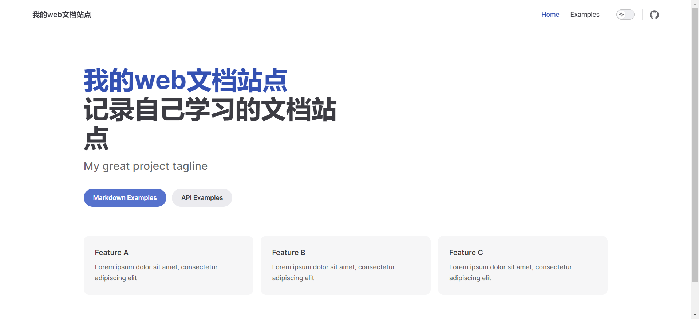

# 说明

记录一下自己利用`VitePress`搭建个人博客的过程。[VitePress官网](https://vitepress.dev/zh/)

## 准备工作

按照[VitePress](https://vitepress.dev/zh/guide/getting-started#installation)官网要求安装环境

- 安装[Node.js](https://nodejs.org/en) 18 及以上版本，本次使用 `node18.18.0`

## 开始

1. 新建一个空的文件夹，取名为 `my-web-docs` ，在 `VSCode` 编辑器中打开。
2. 在终端中运行 `npm add -D vitepress` 命令，安装 `VitePress` 。
3. 在终端中运行 `npx vitepress init` 命令。  
   启动设置向导。

命令和向导操作记录图如下：
  
4. 在终端中运行 `npm run docs:dev` 命令，启动本地服务器，即可看到效果，如下图。


## 修改首页
接下来对首页进行修改，完成下图所示效果。


### 修改导航栏

导航栏显示在页面顶部。它包含站点标题、全局菜单链接等，对应上图顶部的红框区域。在 vitepress 的配置文件`config.mts` 中设置。  
注意`nav`内每一项的 `link` 属性，是文章的所在目录，按照实际填写即可。[参考链接](https://vitepress.dev/zh/reference/default-theme-nav#navigation-links)

```ts:line-numbers
// .vitepress/config.mts
import { defineConfig } from "vitepress";

export default defineConfig({
  title: "我的web文档站点",
  description: "记录自己学习的文档站点",
  themeConfig: {
    nav: [
      { text: "指南", link: "/guide/what-is-vitepress" },
      { text: "参考", link: "/markdown-examples" },
    ],
    socialLinks: [
      { icon: "github", link: "https://github.com/vuejs/vitepress" },
    ],
  },
});
```

### 修改首页主体

下面的红框区域是首页的主体内容，在 `docs/index.md` 中书写，按照此文件书写即可生成上图效果。

```md
// docs/index.md

layout: home

hero:
name: "VitePress"
text: "由 Vite 和 Vue 驱动的静态站点生成器"
tagline: 将 Markdown 变成优雅的文档，只需几分钟
image:
src: https://vitepress.dev/vitepress-logo-large.webp
alt: 头像
actions: - theme: brand
text: 说明
link: /markdown-examples - theme: alt
text: 介绍
link: /api-examples

features:

- icon: 📝
  title: 要素 1
  details: 要素 1 的描述
- icon: 💪
  title: 要素 2
  details: 要素 2 的描述
- icon: 🚀
  title: 要素 3
  details: 要素 3 的描述

---
```

## 修改文章页

找到导航栏区域右侧的指南，点击后会跳转到文章页。注意需要在`config.mts`中进行配置,也就是行号为`9`的那一行，意思是链接到 `docs/guide/what-is-vitepress.md`文件。  
自行在 docs 文件夹下新建一个名为`guide`的文件夹，然后在该文件夹下新建一个名为`what-is-vitepress.md`的文件，并写入以下内容，即可看到下图中的效果

```md
# 一级标题

一级标题内容

## 二级标题

二级标题内容

### 三级标题

三级标题内容

#### 四级标题

四级标题内容
```


### 修改大纲
修改VitePress的配置文件`config.mts`，即可看到下图的效果（[修改大纲](https://vitepress.dev/zh/reference/default-theme-config#outline)）。原来默认只显示了二级标题，且大纲的标题是英文。
```ts
// .vitepress/config.mts
export default defineConfig({
  themeConfig: {
    outline: { // 页面右侧大纲 // [!code ++]
      label: "页面导航", // 显示在大纲上的标题，默认值是"On this page" // [!code ++]
      level: [2, 6], // 设置显示在大纲上的标题的等级[h2-h6]，默认值是2 // [!code ++]
    },
  },
});
```


### 添加侧边栏
继续修改VitePress的配置文件`config.mts`，`items`的每一项的`link`属性就是对应文章页的链接，改为对应的的文章路径即可。现在，我们可以看到左侧多了侧边栏。细心点可能会发现，右下角也多了一个链接到下一页的文本，称之为`docFooter`,这是VitePress自动为我们生成的。
```ts
// .vitepress/config.mts
export default defineConfig({
  themeConfig: {
    sidebar: [ // [!code ++]
      { // [!code ++]
        text: '简介', // [!code ++]
        items: [ // [!code ++]
          { text: '什么是 VitePress？', link: '/' }, // [!code ++]
          { text: '快速开始', link: '/' }, // [!code ++]
          { text: '路由', link: '/' }, // [!code ++]
          { text: '部署', link: '/' }, // [!code ++]
        ] // [!code ++]
      }, // [!code ++]
      { // [!code ++]
        text: '写作', // [!code ++]
        items: [ // [!code ++]
          { text: 'Markdown扩展', link: '/' }, // [!code ++]
          { text: '资源处理', link: '/' }, // [!code ++]
          { text: '国际化', link: '/' }, // [!code ++]
        ] // [!code ++]
      } // [!code ++]
    ] // [!code ++]
  },
});
```

### 修改docFooter
现在docFooter里面显示有英文，我们希望显示中文，我们再次修改VitePress的配置文件`config.mts`。  
因为我们当前在第一页，没有上一页，所以只显示下一页。
```ts
// .vitepress/config.mts
export default defineConfig({
  themeConfig: {
    docFooter: { // [!code ++]
      prev: '上一页', // [!code ++]
      next: '下一页' // [!code ++]
    } // [!code ++]
  },
});
```


## 部署
这里我部署到GitHub

### 建立本地git仓库
1. 初始化git仓库，在项目根目录下（my-docs）打开终端，执行以下命令，初始化一个`git`仓库
```sh
git init
```
2. 添加`.gitignore`文件，忽略一些不必要提交的文件
```
node_modules
cache
dist
```

### 添加github部署配置文件
按照[官网说明](https://vitepress.dev/zh/guide/deploy#github-pages)，在项目根目录下新建`.github`文件夹，在`.github`文件夹内新建一个子文件夹`workflows`，在`workflows`文件夹内新建一个`deploy.yml`文件，复制官网给的配置，内容如下：
```yml:line-numbers
# 构建 VitePress 站点并将其部署到 GitHub Pages 的示例工作流程
#
name: Deploy VitePress site to Pages

on:
  # 在针对 `main` 分支的推送上运行。如果你
  # 使用 `master` 分支作为默认分支，请将其更改为 `master`
  push:
    branches: [main]

  # 允许你从 Actions 选项卡手动运行此工作流程
  workflow_dispatch:

# 设置 GITHUB_TOKEN 的权限，以允许部署到 GitHub Pages
permissions:
  contents: read
  pages: write
  id-token: write

# 只允许同时进行一次部署，跳过正在运行和最新队列之间的运行队列
# 但是，不要取消正在进行的运行，因为我们希望允许这些生产部署完成
concurrency:
  group: pages
  cancel-in-progress: false

jobs:
  # 构建工作
  build:
    runs-on: ubuntu-latest
    steps:
      - name: Checkout
        uses: actions/checkout@v4
        with:
          fetch-depth: 0 # 如果未启用 lastUpdated，则不需要
      # - uses: pnpm/action-setup@v3 # 如果使用 pnpm，请取消注释
      # - uses: oven-sh/setup-bun@v1 # 如果使用 Bun，请取消注释
      - name: Setup Node
        uses: actions/setup-node@v4
        with:
          node-version: 20
          cache: npm # 或 pnpm / yarn
      - name: Setup Pages
        uses: actions/configure-pages@v4
      - name: Install dependencies
        run: npm ci # 或 pnpm install / yarn install / bun install
      - name: Build with VitePress
        run: npm run docs:build # 或 pnpm docs:build / yarn docs:build / bun run docs:build
      - name: Upload artifact
        uses: actions/upload-pages-artifact@v3
        with:
          path: docs/.vitepress/dist

  # 部署工作
  deploy:
    environment:
      name: github-pages
      url: ${{ steps.deployment.outputs.page_url }}
    needs: build
    runs-on: ubuntu-latest
    name: Deploy
    steps:
      - name: Deploy to GitHub Pages
        id: deployment
        uses: actions/deploy-pages@v4
```
### 设置基础路径
修改`config.mts`文件，`base`属性值需要以`/`开头和结尾， 中间内容与github仓库名保持一致，具体要求可查看[官网文档](https://vitepress.dev/zh/reference/site-config#base)。
```ts
export default defineConfig({
  // ... 其他配置
  base: '/my-web-docs/', // [!code ++]
})
```
### 新建github仓库  
注意：**仓库名这里设置为和上面配置`base`属性一致**
<!--  -->


### 修改github仓库配置
仓库新建完成之后，按照下图修改一下仓库设置


### 提交代码并推送到github仓库
```sh
# 添加所有文件到暂存区
git add .
# 提交暂存区文件
git commit -m "首次提交"
```
```sh
# 重命名当前分支为main，如果配置部署文件时，第9行的分支名是master，则无需执行此条命令
git branch -M main
# 添加远程仓库
git remote add origin git@github.com:wuzheng007/my-web-docs.git
# 将本地分支推送到远程仓库
git push -u origin main
```

### 检查部署结果
代码推送到`gitub`成功后，刷新页面，看到下图说明部署成功了，可以点击链接进行访问

### 重新执行工作流
没有没有看到上面部署成功的结果，可以自行按照下图操作，重新执行一下工作流，执行完成后再次查看效果


## 文件目录结构图:


参考链接[AlbertZhang 的文档站](https://docs.bugdesigner.cn/docs/Tutorial/vitepress.html)、[千帆的博客](https://helloahao096.github.io/helloahao/posts/GitHub%20Action%E4%B8%80%E9%94%AE%E9%83%A8%E7%BD%B2%E4%B8%AA%E4%BA%BA%E5%8D%9A%E5%AE%A2.html)
