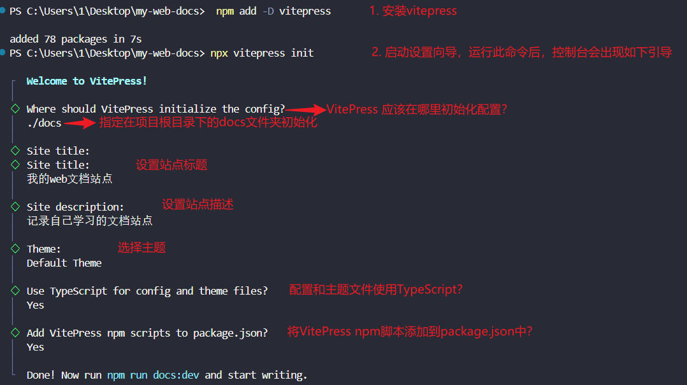

# 说明

记录一下自己利用`VitePress`搭建个人博客的过程。

## 准备工作

按照[VitePress](https://vitepress.dev/zh/guide/getting-started#installation)官网要求安装环境

- 安装[Node.js](https://nodejs.org/en) 18 及以上版本，本次使用 `node18.18.0`

## 开始

1. 新建一个空的文件夹，取名为 `my-web-docs` ，在 `VSCode` 编辑器中打开。
2. 在终端中运行 `npm add -D vitepress` 命令，安装 `VitePress` 。
3. 在终端中运行 `npx vitepress init` 命令。  
   启动设置向导。

命令和向导操作记录图如下：
  
4. 在终端中运行 `npm run docs:dev` 命令，启动本地服务器，即可看到效果，如下图。

## 修改配置

参考链接[AlbertZhang 的文档站](https://docs.bugdesigner.cn/docs/Tutorial/vitepress.html)、[千帆的博客](https://helloahao096.github.io/helloahao/posts/GitHub%20Action%E4%B8%80%E9%94%AE%E9%83%A8%E7%BD%B2%E4%B8%AA%E4%BA%BA%E5%8D%9A%E5%AE%A2.html)
